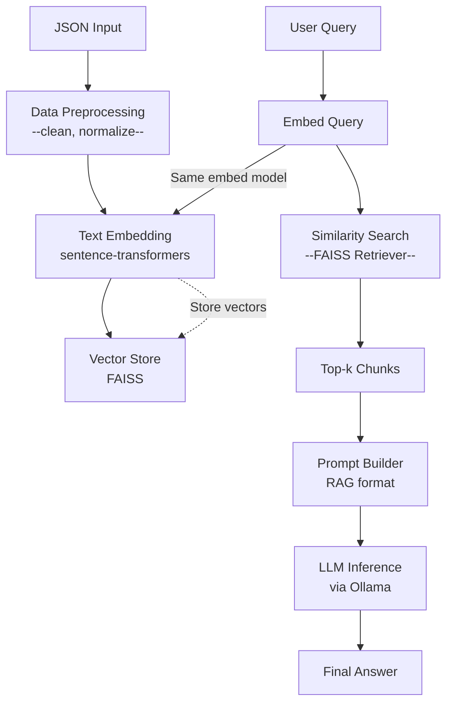

# FAQ Forge

FAQ Forge is a lightweight, local-first generative AI stack for transforming static FAQ lists into intelligent, queryable AI agents. 

It enables developers to turn a simple JSON file of Q&A pairs into a responsive system that retrieves relevant content and generates contextual answers using a Retrieval-Augmented Generation (RAG) pipeline.

> Designed for simplicity, speed, and privacy — all runnable on your local machine in under 45 minutes.

## Features

- Turn JSON-based FAQs into intelligent assistants
- Fast and local: no cloud dependencies, no API keys required
- Uses sentence-transformers and FAISS for embeddings & search
- Runs local LLMs via Ollama (e.g. Mistral, LLaMA2)
- 100% offline and privacy-preserving
- Designed to be hackable and extendable

## When to Use This Stack

- Local prototyping or hackathon projects
- Privacy-sensitive use cases
- Fast iteration on small/medium datasets
- Developer testing before scaling to cloud APIs

### Use Cases

- Interactive FAQ bots for documentation or internal tools
- AI agents for product support or onboarding
- Local experimentation for Retrieval-Augmented Generation (RAG)
- Privacy-first assistants for sensitive data

## Architecture Overview



## CLI Commands

FAQ Forge uses a Typer-based CLI with several commands. Below are some of the primary commands along with example usages:

- **Preprocess**: Clean and validate FAQ data.
  ```bash
  faq-toolkit preprocess path/to/input.json path/to/output.json
  ```
- **Validate**: Check FAQ data for schema compliance.
  ```bash
  faq-toolkit validate path/to/input.json
  ```
- **Build Index**: Generate embeddings and build a FAISS index from cleaned FAQ data.
  ```bash
  faq-toolkit build-index path/to/cleaned.json path/to/index_file
  ```
- **Retrieve**: Retrieve the top FAQ items for a given query.
  ```bash
  faq-toolkit retrieve "Your query here" --index_file path/to/index_file --data_file path/to/cleaned.json
  ```
- **LLM Inference**: Build a prompt from retrieved FAQs and perform LLM inference.
  ```bash
  faq-toolkit llm-infer "Your query here" --index_file path/to/index_file --data_file path/to/cleaned.json
  ```
- **Prepare Model**: Build the FAISS index and perform an LLM readiness check.
  ```bash
  faq-toolkit prepare-model path/to/cleaned.json path/to/index_file
  ```
- **Get Result**: Retrieve context and perform LLM inference (assumes the model is already prepared).
  ```bash
  faq-toolkit get-result "Your query here" --index_file path/to/index_file --data_file path/to/cleaned.json
  ```

## Guide

### Docker Usage

FAQ Forge is packaged as a Docker image for easy deployment and testing. You can run any of the CLI commands via Docker.

1. **Build the Docker image:**
    ```bash
    docker build -t heritage_forge_faq_agent:latest .
    ```
2. **Run the container to display help:**
    ```bash
    docker run --rm heritage_forge_faq_agent:latest --help
    ```
3. **Run a specific command (e.g. search):**
    ```bash
    docker run --rm heritage_forge_faq_agent:latest retrieve --query "3D parts?" --index_file /path/to/index_file --data_file /path/to/cleaned.json
    ```
4. **Run interactively (if needed):**
    ```bash
    docker run --rm -it heritage_forge_faq_agent:latest
    ```

### Testing & Continuous Integration

A simplified GitHub Actions CI is provided to run tests and build your Docker image. The CI workflow performs the following steps:
- Checkout code and set up Python.
- Install dependencies from `requirements.txt` (make sure your dependency versions are valid).
- Run tests with `pytest`.
- Build and test your Docker image.

See the [CI configuration](.github/workflows/ci.yml) for more details.

## Contributing

Contributions, issues, and feature requests are welcome!  
Feel free to [open an issue](https://github.com/Heritage-Forge/faq-forge/issues/new) or fork the project.

## License

MIT © [Heritage Forge](https://github.com/Heritage-Forge)
