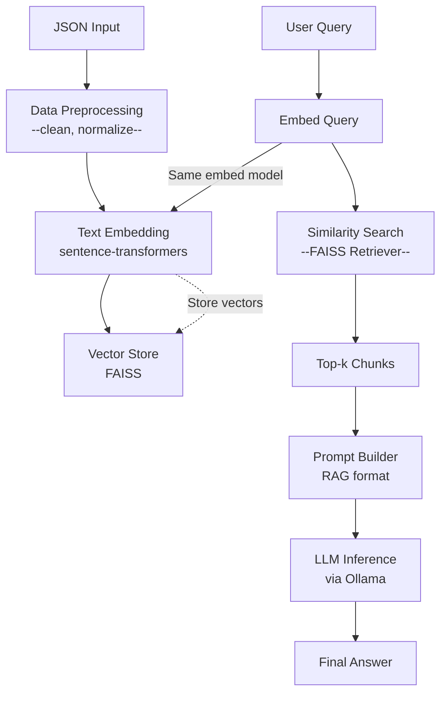

# FAQ Forge
FAQ Forge is a lightweight, local-first generative AI stack for transforming static FAQ lists into intelligent, queryable AI agents. 

It enables developers to turn a simple .json file of Q&A pairs into a responsive system that retrieves relevant content and generates contextual answers using a Retrieval-Augmented Generation (RAG) pipeline.

> Designed for simplicity, speed, and privacy — all runnable on your local machine in under 45 minutes.

## Features
- Turn JSON-based FAQs into intelligent assistants
- Fast and local: no cloud dependencies, no API keys required
- Uses sentence-transformers and FAISS for embeddings & search
- Runs local LLMs via Ollama (e.g. Mistral, LLaMA2)
- 100% offline and privacy-preserving
- Designed to be hackable and extendable

## When to Use This Stack

- Local prototyping or hackathon projects
- Privacy-sensitive use cases
- Fast iteration on small/medium datasets
- Developer testing before scaling to cloud APIs

### Use Cases
- Interactive FAQ bots for documentation or internal tools
- AI agents for product support or onboarding
- Local experimentation for Retrieval-Augmented Generation (RAG)
- Privacy-first assistants for sensitive data

## Architecture Overview



## Tradeoffs

| Component               | Choice                            |  Pros                                                                 | Tradeoffs / Cons                                                  |
|------------------------|-----------------------------------|------------------------------------------------------------------------|---------------------------------------------------------------------|
| **Input Format**       | JSON                              | Easy to parse, native in Python                                        | Less performant for large structured data (vs. Parquet)            |
| **Preprocessing**      | Custom logic with `pandas`        | Quick and readable, pandas is powerful                                 | Not scalable beyond memory, may need optimization for large data   |
| **Embedding Model**    | `sentence-transformers` (MiniLM)  | Fast, accurate enough, fully local                                     | Not state-of-the-art for domain-specific queries                   |
| **Vector Store**       | FAISS (CPU)                       | Lightweight, fast, local, minimal setup                                | No persistence between runs without manual save/load               |
| **Retriever**          | FAISS top-k search                | Simple cosine similarity                                               | No semantic reranking (e.g. re-rank with cross-encoder)            |
| **Prompt Builder**     | Basic concatenation (RAG format)  | Transparent and controllable                                           | No advanced formatting or context window optimization              |
| **LLM Inference**      | Ollama + Mistral      | Fully offline, fast on M1, no API keys                                 | Limited context length & accuracy vs. GPT-4                        |
| **Overall System**     | Local-first architecture          | Private, fast, reproducible                                            | Not suitable for high-scale or real-time production use            |

## Guide

### Docker Usage
1. Build the image:
    ```bash
    docker build -t heritage_forge_search:latest .
    ```
2. Run a command (e.g. search):
    ```bash
    docker run --rm heritage_forge_search:latest search --query "3D parts?"
    ```

## Contributing
Contributions, issues, and feature requests are welcome!
Feel free to [open an issue](https://github.com/Heritage-Forge/faq-forge/issues/new) or fork the project.

## License
MIT © [Heritage Forge](https://github.com/Heritage-Forge)

